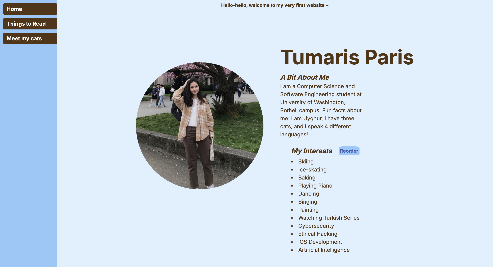
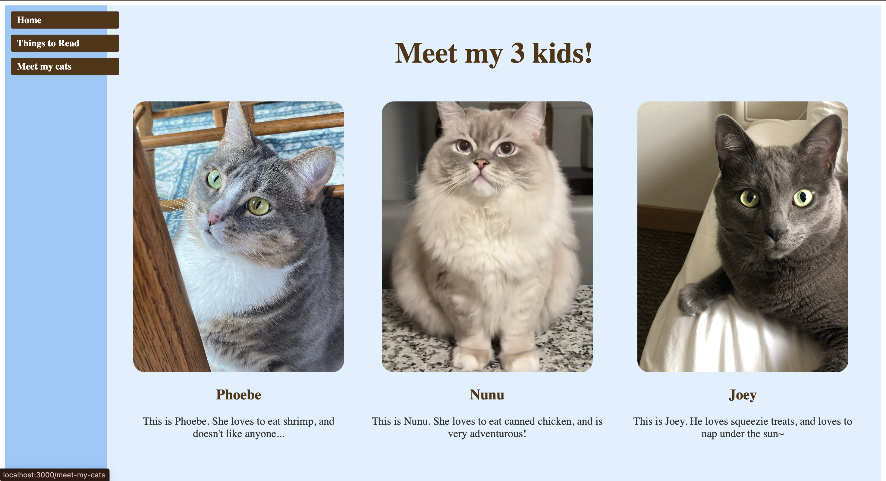
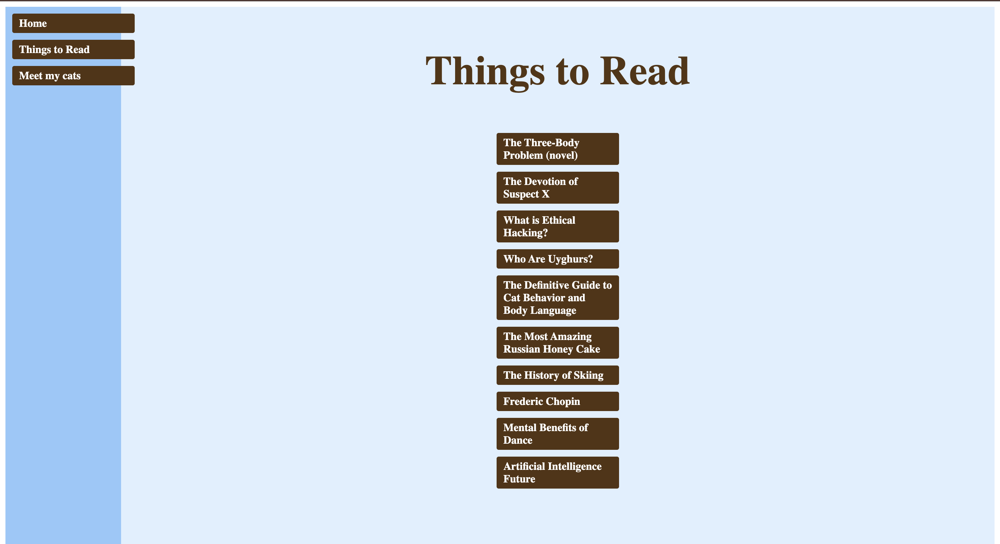

# Tumaris Personal Website (Next.js)

This is my first ever personal website project, built with [Next.js](https://nextjs.org/) and styled using [Tailwind CSS](https://tailwindcss.com/). The website showcases my interests, including my love for cats and reading, and serves as a creative way to explore modern web development tools.

## 🎼 Website Preview

### Homepage


### Meet My Cats


### Things to Read


> *To update the screenshots, place your updated images in the `public` folder and ensure the names match those above.*

---

## Getting Started

First, run the development server:

```bash
npm run dev
# or
yarn dev
# or
pnpm dev
# or
bun dev
```

Open [http://localhost:3000](http://localhost:3000) with your browser to see the result.

You can start editing the page by modifying `app/page.tsx`. The page auto-updates as you edit the file.

This project uses [`next/font`](https://nextjs.org/docs/basic-features/font-optimization) to automatically optimize and load Inter, a custom Google Font.

---

## 🚀 Features
- **Meet My Cats**: Introduces my cats Joey, Nunu, and Phoebe 🐱
- **Things to Read**: A curated list of books and articles 📚
- Fully responsive design for all devices
- Built using modern technologies: Next.js and Tailwind CSS

---

## 📂 Project Structure
- **`/pages`**: Contains individual pages (`meet-my-cats.js`, `things-to-read.js`).
- **`/public`**: Stores static assets like cat images and screenshots.
- **`/components`**: Reusable React components for building the website.
- **`tailwind.config.ts`**: Configuration for Tailwind CSS.

---

## Learn More

To learn more about Next.js, take a look at the following resources:

- [Next.js Documentation](https://nextjs.org/docs) - learn about Next.js features and API.
- [Learn Next.js](https://nextjs.org/learn) - an interactive Next.js tutorial.

You can check out [the Next.js GitHub repository](https://github.com/vercel/next.js/) - your feedback and contributions are welcome!

---

## Deploy on Vercel

The easiest way to deploy your Next.js app is to use the [Vercel Platform](https://vercel.com/new?utm_medium=default-template&filter=next.js&utm_source=create-next-app&utm_campaign=create-next-app-readme) from the creators of Next.js.

Check out our [Next.js deployment documentation](https://nextjs.org/docs/deployment) for more details.

---

## 🌐 Deployment

This website can also be deployed using platforms like [Vercel](https://vercel.com/) or [Netlify](https://netlify.com/). For detailed deployment instructions, check out the [Next.js deployment documentation](https://nextjs.org/docs/deployment).

---

## 🤝 Contributions

Feedback and contributions are welcome! Feel free to open an issue or submit a pull request.

---

## 🐟 License

This project is open-source and available under the [MIT License](LICENSE).

